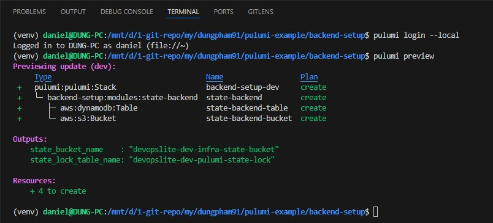
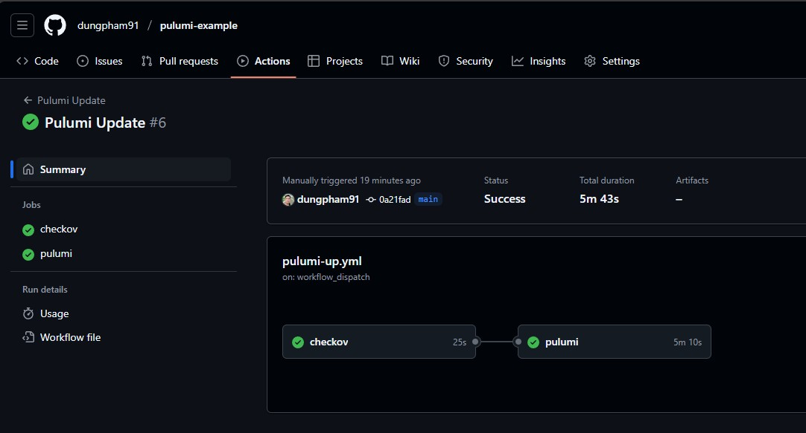
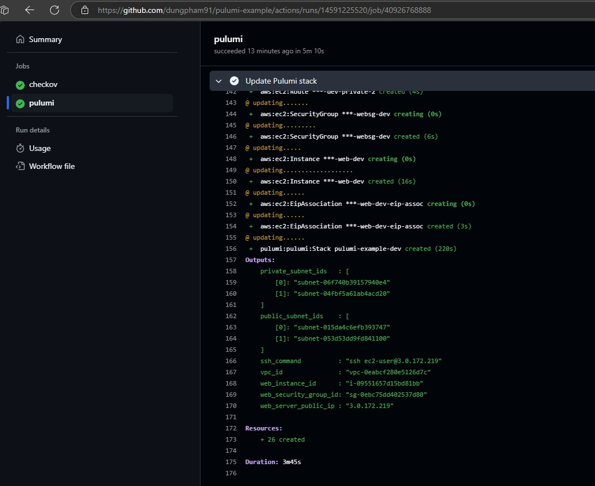

# Pulumi AWS Infrastructure Example

Welcome to the Pulumi Example repository! This guide walks you through creating a cloud-based infrastructure using Pulumi with AWS, featuring proper state management and infrastructure deployment.

---

## 📋 Table of Contents
  - [🚀 Prerequisites & Versions](#-prerequisites--versions)
  - [🏗️ Project Structure](#️-project-structure)
  - [🔧 Setting Up the Backend Stack](#-setting-up-the-backend-stack)
  - [⚙️ Setting Up the Infrastructure Stack](#️-setting-up-the-infrastructure-stack)
    - [Execute Pulumi manually using CLI](#execute-pulumi-manually-using-cli)
    - [Using CI with GitHub Actions](#using-ci-with-github-actions)
  - [🛡️ Custom Policy Pack with Pulumi](#️-custom-policy-pack-with-pulumi)
    - [Policies Included](#policies-included)
    - [How to Use the Policy Pack](#how-to-use-the-policy-pack)
    - [Benefits of Using Policy Packs](#benefits-of-using-policy-packs)
    - [Policy Packs limitations](#policy-packs-limitations)
  - [🧹 Cleaning Up the Environment](#-cleaning-up-the-environment)
    - [Infrastructure Stack Cleanup](#infrastructure-stack-cleanup)
    - [Backend Stack Cleanup](#backend-stack-cleanup)
    - [Additional Notes](#additional-notes)

---

## 🚀 Prerequisites & Versions

Before you begin, ensure you have the following installed:

- **Pulumi CLI**: v3.163.0
- **Python**: 3.12.3
- **AWS CLI** with configured credentials
- **Git**

---

## 🏗️ Project Structure

```
.
├── LICENSE
├── README.md
├── backend-setup                           # Create S3 bucket and DynamoDB directory to use as backend
│   ├── Pulumi.dev.yaml                     # Dev stack configuration file
│   ├── Pulumi.prod.yaml                    # Prod stack configuration file
│   ├── Pulumi.yaml                         # Backend-setup project configuration file
│   ├── __main__.py
│   ├── config.py                           # Configuration file for modules
│   └── modules                             # Folder containing modules of backend-setup project
│       ├── __init__.py
│       └── state_backend.py
├── images                                  # Folder containing images for README
├── infra                                   # Pulumi code of main infra project
│   ├── Pulumi.dev.yaml                     # Dev environment stack configuration file
│   ├── Pulumi.prod.yaml                    # Prod environment stack configuration file
│   ├── Pulumi.yaml                         # Configuration file of main infra project
│   ├── __main__.py
│   ├── config.py                           # Configuration file for modules
│   └── modules
│       ├── __init__.py
│       ├── network.py                      # Module to create VPC
│       ├── security_group.py               # Module to create Security Group
│       └── webserver.py                    # Module to create EC2 instance and install Nginx
├── policy-pack                             # Custom policy pack folder for Pulumi
│   ├── PulumiPolicy.yaml
│   ├── __init__.py
│   ├── __main__.py
│   └── aws                                 # Folder contains AWS policies
│       ├── __init__.py
│       └── ec2                             # Folder contains EC2 service policies
│           ├── __init__.py
│           ├── deny_public_ssh.py          # Policy deny SG rule is allowing public SSH
│           └── restrict_ingress_ports.py   # Policy deny SG rule is allowing public ports other than 80, 443
└── requirements.txt
```

This project is organized into three main components:

1. **`backend-setup`**: Creates an S3 bucket and DynamoDB table for Pulumi state management.
2. **`infra`**: Deploys the actual infrastructure (VPC, EC2 with Nginx, Security Groups).
3. **`policy-pack`**: Pulumi CrossGuard custom policy pack with 2 policies created to demo Security Group resource scanning.

---

## 🔧 Setting Up the Backend Stack

Please also setup AWS credential on your machine before using Pulumi. You can use below command to export IAM credential.

```sh
export AWS_ACCESS_KEY_ID="your-iam-key-id"
export AWS_SECRET_ACCESS_KEY="your-iam-key-secret"
```

After cloning this repository to your computer. Here are the steps to use it:

1. Move into the [backend-setup](./backend-setup/) folder.
2. Create stack for Dev environment. Pulumi will now ask you to enter a passphrase which is used to encrypt/decrypt the configs and secrets set up in Pulumi.

```sh
pulumi stack init dev
```


After init stack is done, you can export `PULUMI_CONFIG_PASSPHRASE` to avoid having to re-enter it multiple times on terminal.

```sh
export PULUMI_CONFIG_PASSPHRASE="your-passphrase"
```

3. Next, we log into the local state on the machine and check the Pulumi code changes for `backend-setup`.

```sh
pulumi login --local
pulumi preview
```



> Why create S3 bucket and DynamoDB? And why login state local for `backend-setup` stack?

> Is it because of the story of "which came first, the egg or the chicken"? Pulumi, like Terraform, allows you to use a remote backend to manage state. In the best case, you use Pulumi Cloud service to store your IaC state. But in this demo, I use S3 bucket to store the state for Pulumi. So where does this S3 bucket come from? Either we have to create it manually or we use IaC to create it. So I use Pulumi to create S3 bucket and DynamoDB, and it is used to store the state for the main stack infrastructure. What about the state of the `backend-setup` that is locally? After having S3 bucket, we can migrate the state there, but for simplicity, I keep it locally.

4. Run the command to execute Pulumi.

```sh
pulumi up -y
```


This process creates:
- An **S3 bucket** for state storage.
- A **DynamoDB table** for state locking.


**Outputs to note:**
- `state_bucket_name`: Your S3 bucket for state storage.
- `state_lock_table_name`: Your DynamoDB table for state locking.

---

## ⚙️ Setting Up the Infrastructure Stack

Once we have created the S3 bucket and DynamoDB, we will create the main stack infrastructure.

There are 2 ways to do this here.

### Execute Pulumi manually using CLI

1. Move into the [infra](./infra/) folder.
2. Change the values ​​inside file [infra/Pulumi.yaml](./infra/Pulumi.yaml) for the following code, rename the S3 bucket, AWS region, and DynamoDB table name.

```yaml
backend:
  # Specify the backend as S3. Pulumi will find the bucket from the login configuration.
  # The full URL will be s3://<your-bucket-name>
  # Pulumi will also automatically detect the DynamoDB table if it follows the convention.
  url: s3://devopslite-dev-infra-state-bucket?region=ap-southeast-1
lock:
  region: ap-southeast-1
  table: devopslite-dev-pulumi-state-lock
```

3. Change the values ​​for the Dev (or Prod) environment in file [infra/Pulumi.dev.yaml](./infra/Pulumi.dev.yaml) to the values ​​you want.
3. Similar to `backend-setup`, init stack for Dev environment.

```sh
pulumi stack init dev
```

4. Then preview the changes and apply the changes.

```sh
pulumi preview
pulumi up -y
```

### Using CI with GitHub Actions

The second way to apply Pulumi to create the main infrastructure is to use GitHub Actions as in my demo. After you change the necessary values ​​in files [infra/Pulumi.yaml](./infra/Pulumi.yaml) and [infra/Pulumi.dev.yaml](./infra/Pulumi.dev.yaml) (like I wrote above), you can activate GitHub Actions to automatically apply Pulumi.

You need to create the following secrets for GitHub Actions.
- `AWS_ACCESS_KEY_ID`
- `AWS_SECRET_ACCESS_KEY`
- `PULUMI_CONFIG_PASSPHRASE`

You can refer to the CI files I wrote in the [.github/workflows](./.github/workflows/) folder.






This process creates:
- A **VPC** with public/private subnets.
- An **EC2 instance** with Nginx installed.
- Appropriate **security groups**.


---

## 🛡️ Custom Policy Pack with Pulumi

Pulumi's CrossGuard feature allows you to enforce policies on your infrastructure as code. In this project, a custom policy pack is included to demonstrate how to enforce security best practices for AWS resources.

### Policies Included

Pulumi provides ready-made templates for you to create policy packs for your project.


> Most important templates like `CIS`, `ISO27001`, `PCI DSS` only support Pulumi with TypeScript language. This demo uses Pulumi with Python so it is not possible to use those `important templates` available.

I have created a policy pack with 2 policies to demo how the resource scan process is generated by Pulumi.

1. **Deny Public SSH Access**:
  - Ensures that no security group allows public SSH access (port 22).
  - File: [`policy-pack/aws/ec2/deny_public_ssh.py`](./policy-pack/aws/ec2/deny_public_ssh.py)

2. **Restrict Ingress Ports**:
  - Restricts ingress rules to only allow HTTP (port 80) and HTTPS (port 443).
  - File: [`policy-pack/aws/ec2/restrict_ingress_ports.py`](./policy-pack/aws/ec2/restrict_ingress_ports.py)

### How to Use the Policy Pack

In this demo, I did not integrate the policy into CI but only used it to scan Pulumi locally.

Now, you just go to the infra directory and run the following command:

```sh
pulumi preview --policy-pack ../policy-pack
```


When you run `pulumi preview` or `pulumi up`, the policies will be enforced, and any violations will be flagged.

### Benefits of Using Policy Packs

- Enforce organizational best practices.
- Prevent misconfigurations before deployment.
- Improve security posture by automating compliance checks.

For more details, refer to the [Pulumi Policy as Code documentation](https://www.pulumi.com/docs/iac/using-pulumi/crossguard/).

### Policy Packs limitations

As I mentioned above, Pulumi supports policy templates very well with TypeScript. But with Python, it is very limited, which is a difficulty for Python users like me.

This makes me want to use Pulumi with Python for the entire project, I have to write the entire policy myself, which is impossible.

Compared to Terraform, this is a big disadvantage, because Terraform is very well supported by tools like Checkov or Snyk in scanning IaC code to find security holes according to current standards. If you are a TypeScript user, this disadvantage can be removed.

But anyway, for me personally, the fact that Pulumi only supports important templates like CIS, ISO27001, PCI DSS for TypeScript but not for other languages, that is a disadvantage.

---

## 🧹 Cleaning Up the Environment

Once you have completed the demo, it is important to clean up the resources to avoid unnecessary costs. Follow these steps to tear down the infrastructure:

### Infrastructure Stack Cleanup

You can use the CI job I wrote in file [`./github/workflows/pulumi-destroy.yml`](./.github/workflows/pulumi-destroy.yml) to clear the main infra stack.


Or you can delete it manually if you previously created it manually as well.

1. Navigate to the [`infra`](./infra/) directory:
  ```sh
  cd infra
  ```

2. Destroy the resources created by the infrastructure stack:
  ```sh
  pulumi destroy -y
  ```

3. Remove the stack:
  ```sh
  pulumi stack rm dev
  ```

### Backend Stack Cleanup

1. Navigate to the `backend-setup` directory:
  ```sh
  cd backend-setup
  ```

2. Destroy the resources created by the backend stack:
  ```sh
  pulumi destroy -y
  ```

3. Remove the stack:
  ```sh
  pulumi stack rm dev
  ```


### Additional Notes

- Ensure that all resources (e.g., S3 buckets, DynamoDB tables, EC2 instances) are deleted to avoid incurring charges.
- If you used GitHub Actions for deployment, you may also want to disable or delete the associated workflows.

By cleaning up the environment, you ensure that no unnecessary resources are left running, keeping your cloud costs under control. 🎉

---

Happy infrastructure as code! 🎉
